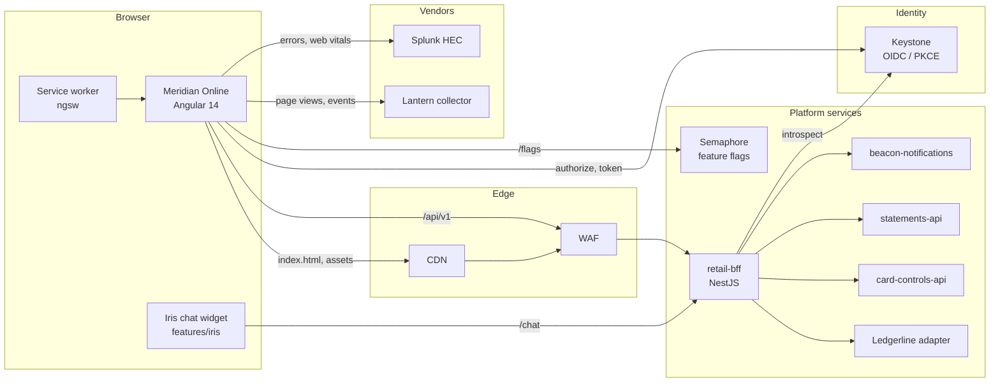

# Meridian Online architecture

Last substantive update 2023-06 (MOL-3290). The diagram has drifted since; corrections welcome,
open an MOL ticket and tag @meridian/cswt-architecture on the PR.

## Overview

Single Angular CLI application, lazy feature modules, one NgRx slice per feature, served as a
static bundle behind the CDN with a service worker for the shell. All data through the retail
BFF (`platform-services/retail-bff`, port 4500 locally). No direct calls from the browser to
core banking or any vendor except Lantern (analytics) and Keystone (identity).

Known inaccuracies, in case you are using this to debug something:

- The Iris widget has not lived in `features/iris` since MOL-3410 (September 2023). It is its own
  repo (`iris-widget`) and loads from the CDN into a `
` in `app.component.html`.
  It still talks to the BFF on `/chat`.
- Semaphore is behind the same WAF as the BFF now, not called directly. The proxy path in
  `proxy.conf.json` reflects the current setup; the diagram does not.
- `beacon-notifications` was split from `alerts-api` in 2024. The BFF fans out to both.
- Web Vitals go to the same Splunk HEC index as errors, but through a separate sourcetype
  (`retail_web:vitals`). The diagram lumps them.

## Request path

1. `index.html` and hashed bundles from the CDN. `ngsw.json` tells the worker what to cache.
2. `APP_INITIALIZER` chain, in this order and blocking: `ConfigService.load()` fetches
   `assets/config/env.json`; `AuthInitializer` configures `angular-oauth2-oidc` from it and
   tries a silent refresh; `FlagsInitializer` pulls the Semaphore snapshot. Nothing renders until
   all three settle. Total budget 800 ms p95; it is around 620 in prod.
3. Router. `initialNavigation: 'enabledBlocking'` so the guards run before first paint.
   `LazyModuleGuard` (`CanLoad`) checks entitlements before the chunk is fetched;
   `FeatureFlagGuard` for flagged modules; `AuthGuard` everywhere below `/auth`.
4. Feature module loads, dispatches its `load` action, effect calls the BFF through the
   interceptor chain.

## Interceptor chain

Registered in `CoreModule` through `HTTP_INTERCEPTORS`, order matters:

1. `CorrelationIdInterceptor`: `X-Correlation-Id`, one per request, reused on retry. The BFF
   echoes it and it is how you join browser and server logs in Splunk.
2. `BearerTokenInterceptor`: `Authorization` on BFF and Semaphore calls only. Explicitly never
   on the Lantern or Splunk hosts (GIS-1802).
3. `HttpCacheInterceptor`: opt-in per request via a context token, short TTL, in-flight
   deduplication. Reference data only.
4. `RetryBackoffInterceptor`: GET/HEAD/OPTIONS only, three attempts, exponential with jitter,
   never on 4xx.
5. `ErrorMappingInterceptor`: RFC 7807 problem responses into `AppError`, 401 into a silent
   refresh then logout.

XSRF is `HttpClientXsrfModule.withOptions` with cookie `MERIDIAN-XSRF` and header
`X-MERIDIAN-XSRF`, which the BFF validates on every non-GET.

## Session

Tokens in session storage (ADR 0008). Idle timeout in `IdleTimeoutService`, RxJS timers driven by
DOM events, warning at 8 minutes, logout at 10, both from `env.json`. The hotfix in MOL-4412 is
the reason the warning dialog no longer resets the timer when it is dismissed by the Escape key.

MFA step-up (`MfaStepUpGuard`): above `transfers.mfaStepUpThresholdMinor` the guard requires an
`mfa_at` claim younger than `mfaMaxAgeSeconds` (600) and otherwise sends the customer to Keystone
with `acr_values=urn:meridian:keystone:loa2` and a return URL. The amount itself is never put in
telemetry, only the band.

## Things not on the diagram

- Splunk `GlobalErrorHandler` fields: `release`, `correlationId`, `route`, `customerIdHash`,
  `userAgent`, `message`, `stack` (truncated to 4 KB).
- CSP is a meta tag in `index.html` (the CDN does not let us set headers per path). No
  `unsafe-inline` for scripts; styles have it because of Material's runtime theming, GIS accepted
  in GIS-1910.
- `ngsw-config.json` caches the shell and fonts, and has two data groups for BFF reference data
  (freshness strategy) and customer data (network first, short cache). Verified in the release
  job by `tools/verify-ngsw.js`.
